# booksi

iBook, is a multi-feature Flutter app with:

E-commerce for books (Cart → Shipping Info → Checkout → Paymob Integration).

Chat & Chatbot for user support.

User Profiles for personalization.

Blog Section to share articles and recommendations.

Tech stack:

Flutter + GetX for state management# 📚 Booksi

**Booksi** is a multi-feature Flutter app that brings together e-commerce, chat, and personalization in one elegant experience.

---

##  Features

- 🛒 **E-commerce for Books** — Browse, add to cart, enter shipping info, checkout, and pay via **Paymob Integration**.  
- 💬 **Chat & Chatbot** — Built-in support chat and AI-powered assistant for user help.  
-  **User Profiles** — Personalized dashboards and settings.  
-  **Blog Section** — Read and share articles & recommendations.

---

##  Tech Stack

| Category | Tools |
|-----------|--------|
| Framework | Flutter |
| State Management | GetX |
| Backend | Firebase (Auth + Firestore) |
| Payment Integration | Paymob |
| Architecture | Feature-Based + Modular (MVC, MVVM) |

---

##  Screenshots

| Home | Book Details | Cart | Checkout | Chat | Profile |Login|Blog|
|------|---------------|------|-----------|------|----------|------|-------|
| 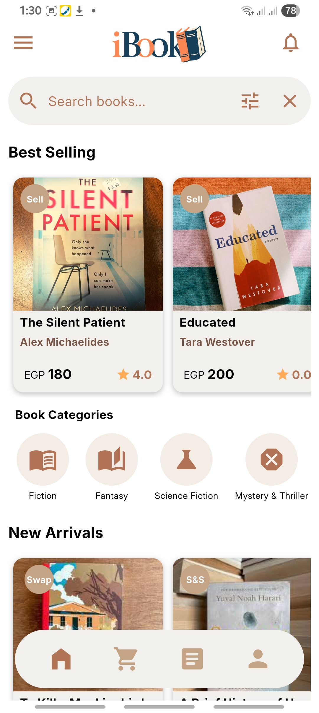 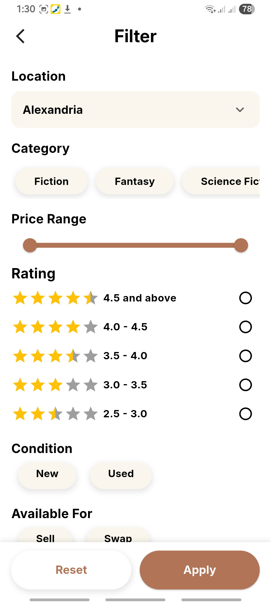 | 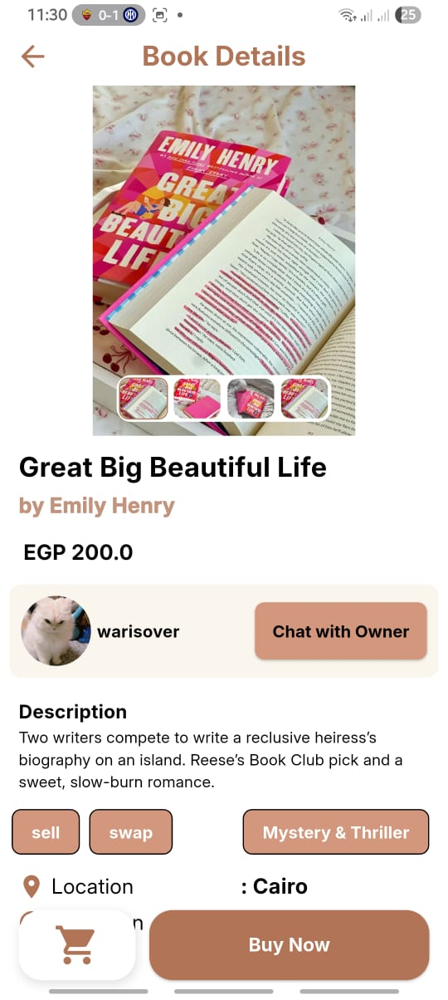 |  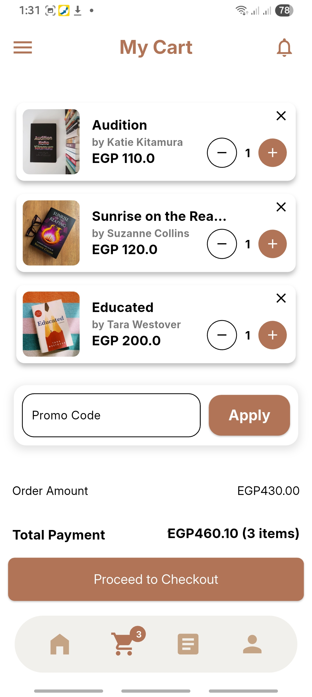 | 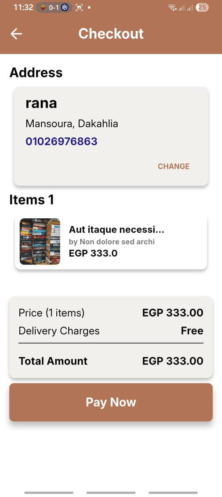  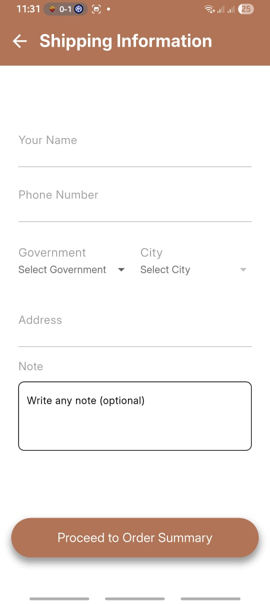  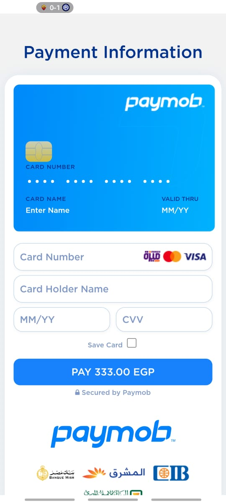 |   | 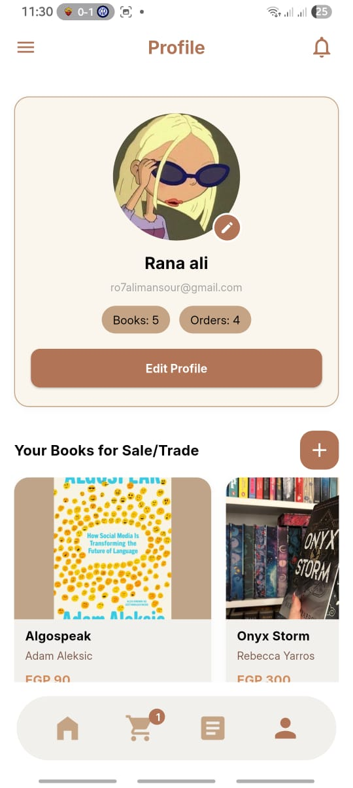 |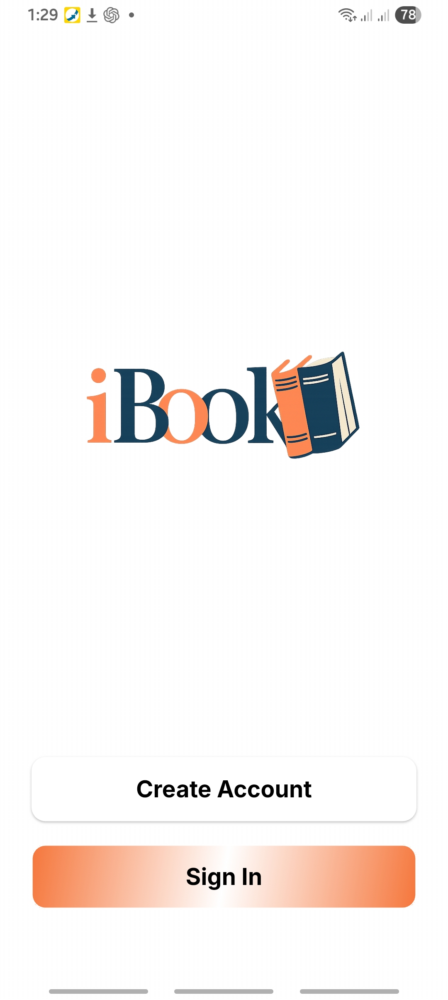 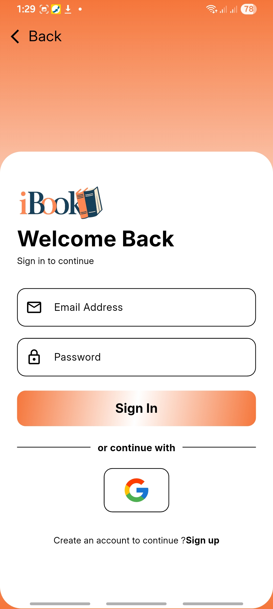 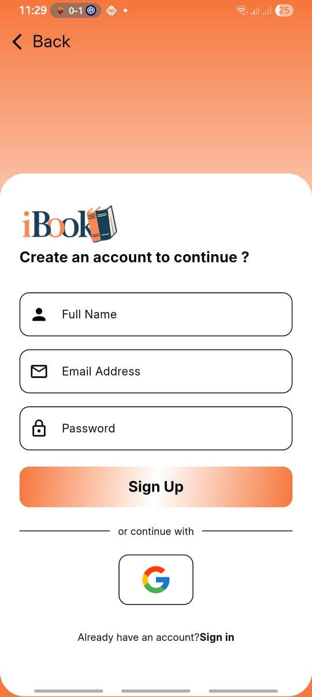|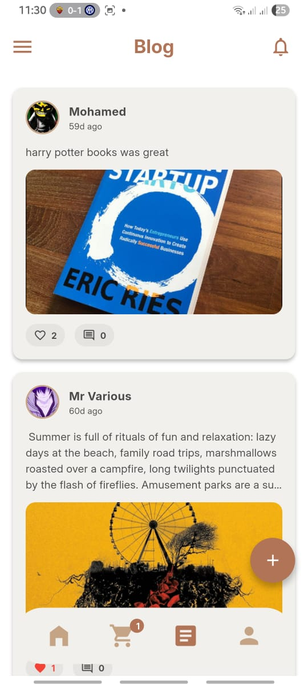 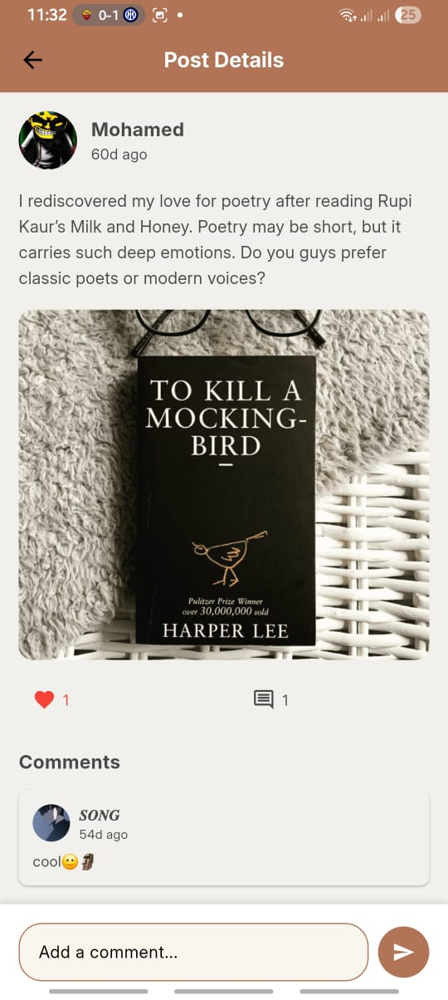|

---

##  About
Built by **Rana**  
Developed with **Flutter** and **GetX**, following clean and scalable architecture principles.

Firebase (Auth + Firestore) as backend

Paymob for secure online payments

Feature-Based Architecture, Modular Code Architecture (MVC, MVVM)
